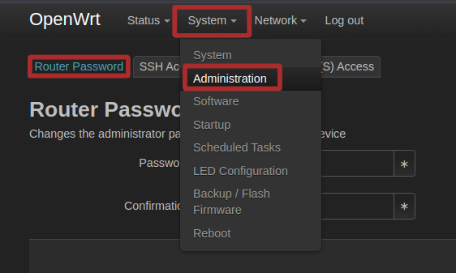

# Flashing OpenWRT OS on Netgear Nighthawk 7800 Router

router specs : NETGEAR R7800 (Nighthawk X4S AC2600)
This document outlines the steps taken to flash the **OpenWRT** firmware onto the **Netgear Nighthawk 7800** router.

## Steps Taken

### 1. Check Compatibility with OpenWRT
The first step was to ensure that the **Netgear Nighthawk 7800** router was compatible with **OpenWRT**. This was done by searching the [OpenWRT device support page](https://openwrt.org/toh/start) for the router model to confirm that OpenWRT firmware was available for the device.

### 2. Download the OpenWRT Firmware
Once compatibility was confirmed, the appropriate **OpenWRT firmware** image for the Netgear Nighthawk 7800 was downloaded. The firmware file was downloaded in the `.img` format, suitable for flashing the router. The image generally ends with `-factory.img`

- Visit the [OpenWRT firmware download page](https://downloads.openwrt.org/).
- Select the correct router model and download the **factory image** ening with `-factory.img`.

### 3. Prepare for Flashing: Connect Router to Laptop
To ensure a stable and reliable connection during the flashing process, the **router** was connected to the **laptop** using an **Ethernet cable**. This avoids potential issues from Wi-Fi instability during the firmware upgrade.

### 4. Flash the Firmware
Next, the **Netgear router's web interface** was accessed to begin the flashing process:
- Open a web browser and navigate to the router’s **admin page**: `http://192.168.1.1`.
- Login to the router’s interface with your credentials. The default credentials can be found on the router.
- Once logged in, navigate to the **Firmware Update** section under **Administration** > **Firmware update**.
- Choose the **"Upload"** option and select the downloaded **factory image** ending with `-factory.img` firmware file.
- Begin the firmware update process. This process may take a few minutes, and the router will reboot automatically.

### 5. Access the Router After Flashing
Once the router rebooted, the **OpenWRT firmware** should be successfully installed.

- Navigate to `http://192.168.1.1` in your browser again.
- The default login credentials for OpenWRT are:
  - **Username**: `root`
  - **Password**: (no password set initially, so leave it blank)

### 6. Set a Root Password
For security, it is crucial to set a strong root password after accessing the OpenWRT web interface.

- Navigate to **System** > **Administration**.
- Set a secure **root password** and save the changes.


### 7. Secure SSH Access
For enhanced security, **SSH key authentication** was set up to allow secure login from the laptop to the router.

#### Steps to Add SSH Key:
- Generate an **SSH key pair** on your laptop if you haven't already. You can do this by running the following command in your terminal (Linux/macOS):
  ```bash
  ssh-keygen 
  # provide the key path and name 
  ```
  copy the generated public key(ending with `.pub`) and paste it in the router's ssh key placeholder. Thus with ssh we can securely connect with the router using cli.
