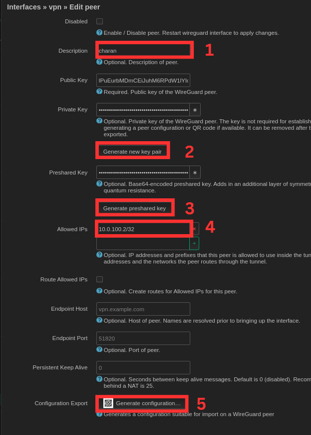

# VPN Server Setup
We had to setup a VPN Server on the openwrt router so that we could access all the local devices in our lab remotely and securely, without the need to configure and open multiple ports. We will setup wireguard server on the router it is a lightweight server.

## Steps Taken:
### 1. Dependencies installation
Installed all the necessary packages for wireguard
```bash
opkg install luci-app-wireguard luci-proto-wireguard kmod-wireguard wireguard-tools qrencode
```
Note: reboot the router after installation

### 2. Create a New interface for Wireguard VPN server
Navigate to **Network** > **Interfaces**. Click on `Add new interface`.
Give the interface a name and select the protocol as WireGuard VPN. 
1. Generate a Public and Private key pair
2. Provide the listen port
3. Provide an IP address for the interface
4. Navigate to `peers` section.  
Note: In the `firewall settings` section select `lan` zone


### 3. Add a new peer 
We need to add the clients individually that need the VPN access.
Navigate to the Peers section and select `Add Peer`
1. Provide a name for the client
2. Generate a public and private key pair
3. Generate a shared key
4. provide the ip address for the client. Make sure it is in the same subnet as the VPN interface. Also note the the subnet mask is `/32` and not `/24`. Because we are assigning a static IP for the client in the vpn interface's subnet we created.  
5. click on generate configuration. We can access the configuration in QR encoded mode and text mode. QR encoded mode can be used to configure android clients and later can be used for linux machine. The configuration should like the below.
    ```
    PrivateKey = 0L***********************U=
    Address = 10.0.100.2/32
    DNS = 192.168.1.1

    [Peer]
    PublicKey = eW***************************I=
    PresharedKey = Yn************************4=
    AllowedIPs = 0.0.0.0/0, ::/0
    Endpoint = xx.xx.xx.xx:9988

    ```
    

### 4. Set port forwarding rules
Navigate to **Network** > **Firewall** > **Port Forwards**. Select `Add` and fill the below info
1. Provide a name
2. Select Protocol to be only UDP
3. select the source zone as WAN
4. Enter the external port number
5. select the destination zone
6. Add the VPN server interface address
7. Enter the interal port number 


### 5. Connecting a client 
We now need to configure the client devices that needs the VPN access. We will be configuring two clients linux(ubuntu 22.04) and android.  
#### I. configuring ubuntu
1. install the wireguard dependencies
```
sudo apt install wireguard resolvconf
```
2. make a configuration file named `wg0.conf` under `/etc/wireguard`.
Copy the previously generated configuration in the previous step and paste it.
Make sure that the endpoint address points to the static IP provided by your ISP.
3. Start the VPN connection
```
wg-quick up wg0
```
verify everything is up and running by checking `ifconfig`, you need to see a new interface with wg0, which indicates the client has successfully connected to the VPN Server.
4. Stop the VPN server
to stop the VPN server we run 
```
wg-quick down wg0
```
Note: In some cases we not be able to use ssh over wireguard VPN, in such cases reduce the MTU (Maximum Transmission Unit) below 1420. To edit MTU naviagate to `interfaces > vpn (edit) > advanced settings `.

### External References
1. https://youtu.be/BbDtc0AhGWU?feature=shared
2. https://youtu.be/RT8drPYW4qs?feature=shared
3. https://dariusz.wieckiewicz.org/en/installing-vpn-server-on-router-openwrt-wireguard/#google_vignette
4. https://www.youtube.com/watch?v=6NIJcsJsRaM